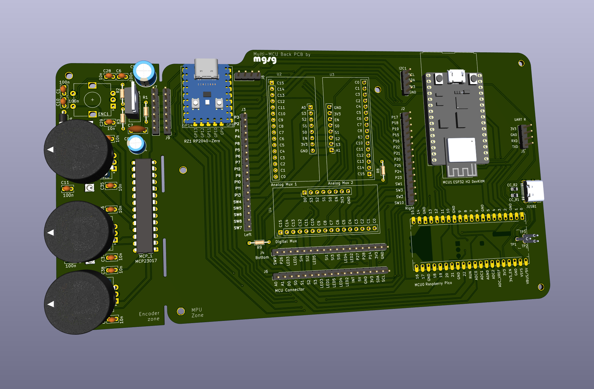
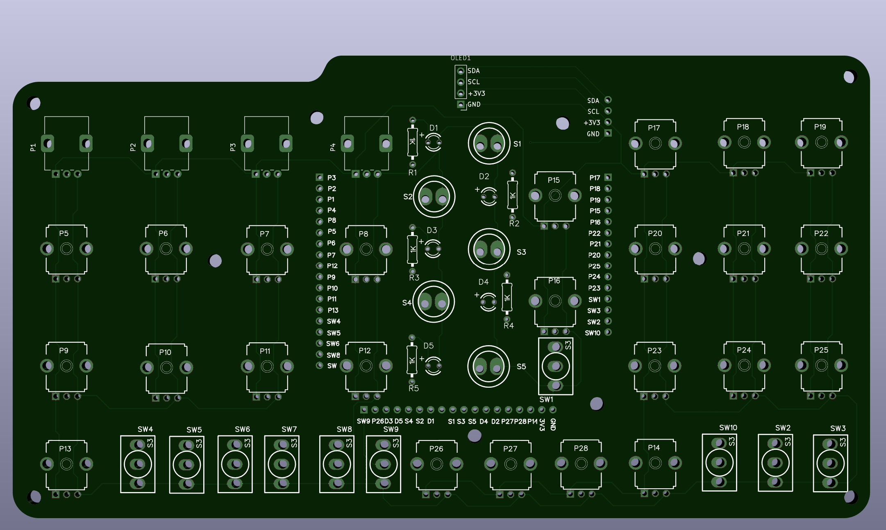
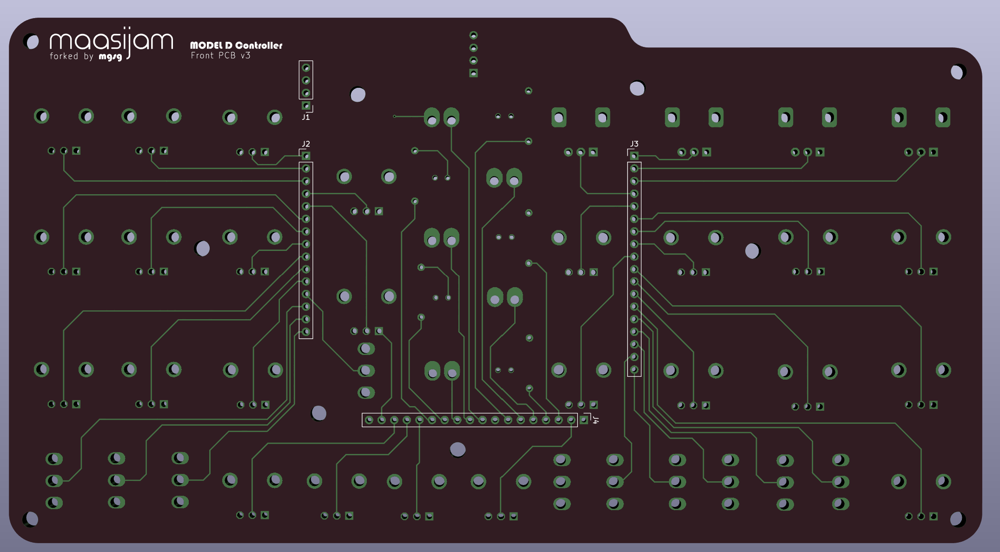
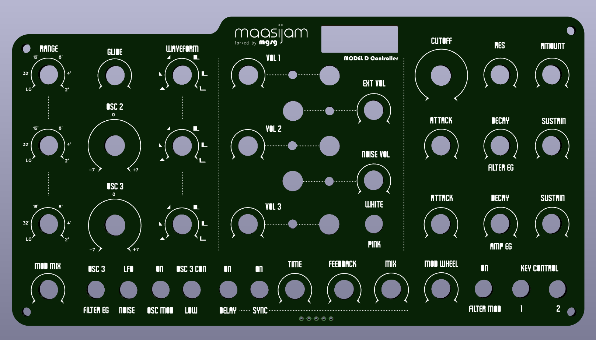

# 20pi - Multi-MPU MIDI Model D Controller

This is a fork of the model_d_controller project hosted  [here](https://github.com/maasijam/model_d_controller). 

## Motivation

- The Teensy LC microcontroller is now deprecated. Alternatives suggested in the project github issues section (Teensy 4.0/4.1) are expensive.

## Changes

The original footprint for all three PCBs has been slightly reduced for cost optimization (5 front PCBs and 5 back PCBs now weight just under 1kg, to reduce shipping cost). 

### Back PCB Changes
- Complete redesign. It supports now either an ESP32 H2 DevKitM, a Raspberry Pico or a Waveshare Zero RP2040.
- It includes an optional front PCB extension (daughterboard) that supports 4 rotary encoders and 4 addressable RGB leds using a GPIO expander. A new enlarged front panel PCB will have to be designed to accomodate this new encoders (PENDING).
- It connects to the back PCB using a header (I2C pins, Interruption, power,...)
- For the Raspberry Pico MCU, the PCB inclues traces for an optional USB-C connector. This connector and a couple of resistors are the only SMD parts, all the rest uses THT parts.
- Instead of 74hc4051 analog multiplexers with 8 channels, addon modules using the "denser" 74hc4061 variant with 16 channels have been used. They can be ordered for almost the same price as the 74hc4051. They can be directly soldered to the back PCB or mounted using "low profile" 3.5mm high sockets.

    
    

### Front PCB Changes
- Added header for I2C 0.91" OLED display to front PCB. It will show the last readout value + CC code sent. Example:
    ```t
    OSC 2 Gain 89%
    MIDI CC 45
    ```
    
    
    
    
### Front Plate Changes
- Added a cutout to the front plate for the OLED display.
- Depending on where you live, laser cutting the Front Plate on acrylic can reduce the cost a lot (at the expense of legibility).

    

### Future additions
- Design extended front plate to laser cut that includes the front PCB extension with the 4 rotary encoders and ARGB leds from the daughterboard.
- Design case to 3D print.

## Original Project Documentation

The complete original README can be accessed [here](https://github.com/maasijam/model_d_controller).
